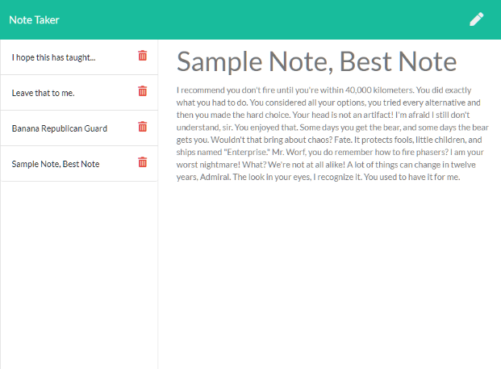

# Note-Taker

 

## Description 

This is an application that can be used to write, save, and delete notes. It uses an Express.js backend and saves and retrieves note data from a JSON file. 

[Deployed Application](https://secure-sands-41336.herokuapp.com/)

## Table of Contents

*   [Description](#Description)
*   [Installation](#Installation)
*   [Usage](#Usage)
*   [Questions](#Questions)
*   [License](#License)
*   [Contributing](#Contributing)
*   [Tests](#Tests)

## Installation

There is nothing to install to use this application. 

## Usage 

After navigating to the URL specified above, click on the "Get Started" button. Enter in a name for your note by clicking on the words "Note Title." Do the same to enter in the main content of your note. Click on the save icon (which looks like a floppy disk) when you are done writing. To delete a note, click on the red trash can icon to the right of its name. 

## Questions

Please email me at the email address listed below with any questions about this app. 

[jdavidrice@gmail.com](mailto:jdavidrice@gmail.com)

Follow this link to see my other projects.

[GitHub Profile](https://github.com/jdavidrice)

## License
    
MIT License

Copyright (c) 2021 Jeremy Rice

Permission is hereby granted, free of charge, to any person obtaining a copy
of this software and associated documentation files (the "Software"), to deal
in the Software without restriction, including without limitation the rights
to use, copy, modify, merge, publish, distribute, sublicense, and/or sell
copies of the Software, and to permit persons to whom the Software is
furnished to do so, subject to the following conditions:

The above copyright notice and this permission notice shall be included in all
copies or substantial portions of the Software.

THE SOFTWARE IS PROVIDED "AS IS", WITHOUT WARRANTY OF ANY KIND, EXPRESS OR
IMPLIED, INCLUDING BUT NOT LIMITED TO THE WARRANTIES OF MERCHANTABILITY,
FITNESS FOR A PARTICULAR PURPOSE AND NONINFRINGEMENT. IN NO EVENT SHALL THE
AUTHORS OR COPYRIGHT HOLDERS BE LIABLE FOR ANY CLAIM, DAMAGES OR OTHER
LIABILITY, WHETHER IN AN ACTION OF CONTRACT, TORT OR OTHERWISE, ARISING FROM,
OUT OF OR IN CONNECTION WITH THE SOFTWARE OR THE USE OR OTHER DEALINGS IN THE
SOFTWARE.

## Contributing

  Jeremy Rice

## Tests

No tests

*   [Return to Top](#Description)
